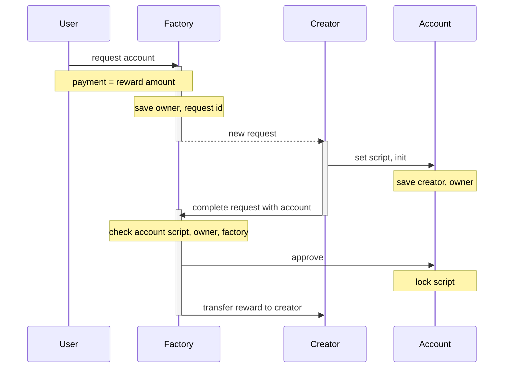
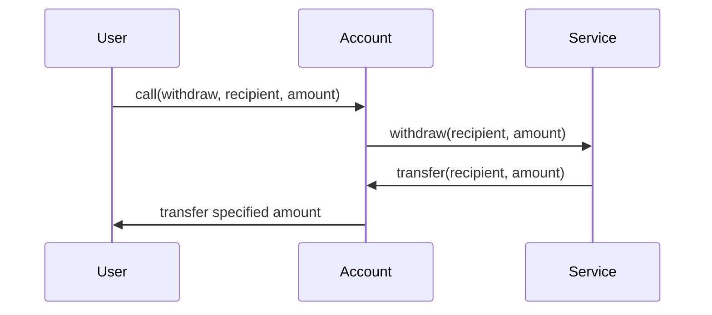

### Participants

- factory
  - service address in storage can be changed by the voting
- owner
  - can call the account callable functions
- account
  - allow orders signed by bot
  - pass functions to service
  - script can't be updated
- bot
  - can use account for trading
- service
  - script can't be updated
  - functions for account

### Storage

#### Factory

| key                                                 | type         | description                           |
| --------------------------------------------------- | ------------ | ------------------------------------- |
| `%s__servicePublicKey`                              | `ByteVector` | Service public key                    |
| `%s__botPublicKey`                                  | `ByteVector` | Bot public key                        |
| `%s__accountScript`                                 | `ByteVector` | Allowed account script                |
| `%s__rewardAmount`                                  | `Int`        | Reward amount                         |
| `%s%s__<accountId>__status`                         | `Integer`    | Account status (0 - empty, 1 - ready) |
| `%s%s__<accountId>__ownerPublicKey`                 | `ByteVector` | Account owner                         |
| `%s%s__<accountId>__creatorPublicKey`               | `ByteVector` | Account creator                       |
| `%s%s__<accountId>__amountAssetId`                  | `ByteVector` | Account amount asset id               |
| `%s%s__<accountId>__priceAssetId`                   | `ByteVector` | Account price asset id                |
| `%s%s__<accountId>__accountIdToAccountPublicKey`    | `ByteVector` | Account id → account public key       |
| `%s%s__<accountAddress>__accountAddressToAccountId` | `String`     | Account address → account id          |

#### Account

| key                    | type         | description         |
| ---------------------- | ------------ | ------------------- |
| `%s__factoryPublicKey` | `ByteVector` | Factory public key  |

### Account creation

### Withdraw

