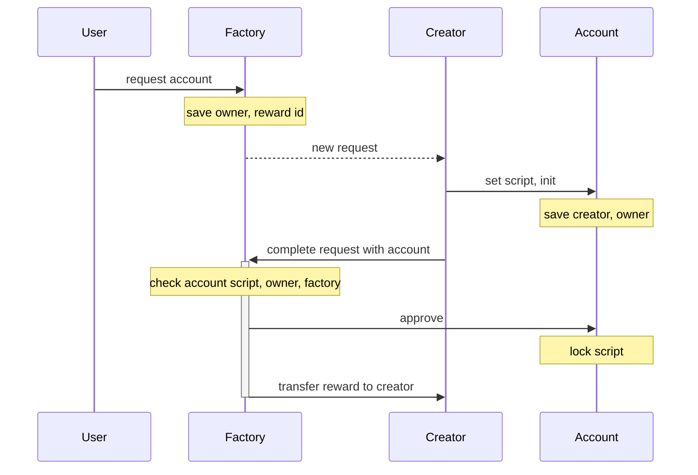
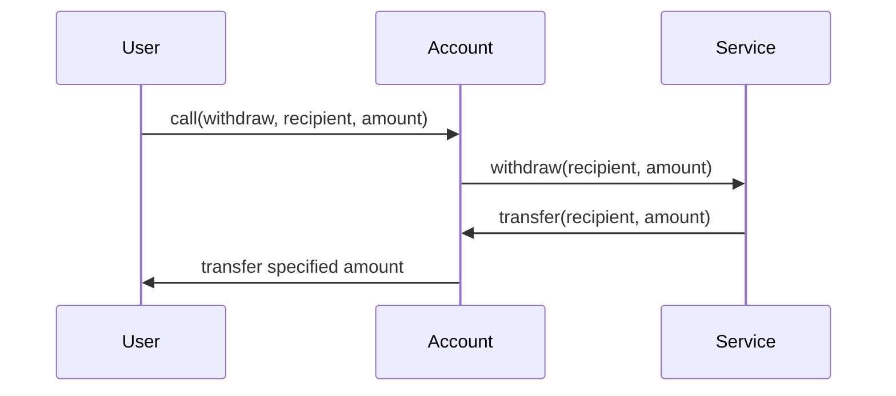

### Participants

- factory
  - service address in storage can be changed by the voting
- owner
  - can call the account callable functions
- account
  - allow orders signed by bot
  - pass functions to service
  - script can't be updated
- bot
  - can use account for trading
- service
  - script can't be updated
  - functions for account

### Storage

#### Factory

| key                            | type         | description                 |
| ------------------------------ | ------------ | --------------------------- |
| `%s__servicePublicKey`         | `ByteVector` | Service public key          |
| `%s__botPublicKey`             | `ByteVector` | Bot public key              |
| `%s__accountScriptHash`        | `ByteVector` | Allowed account script hash |
| `%s__rewardAmount`             | `Int`        | Reward amount               |
| `%s%s__<requestId>__completed` | `Boolean`    | Request completed           |
| `%s%s__<requestId>__owner`     | `ByteVector` | Request owner public key    |

#### Account

| key                    | type         | description         |
| ---------------------- | ------------ | ------------------- |
| `%s__verified`         | `Boolean`    | Verified by factory |
| `%s__factoryPublicKey` | `ByteVector` | Factory public key  |
| `%s__ownerPublicKey`   | `ByteVector` | Owner public key    |

### Account creation

### Withdraw

