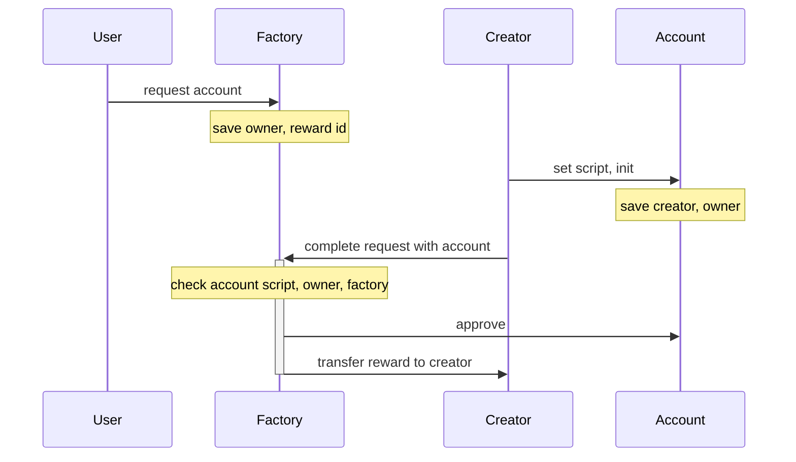
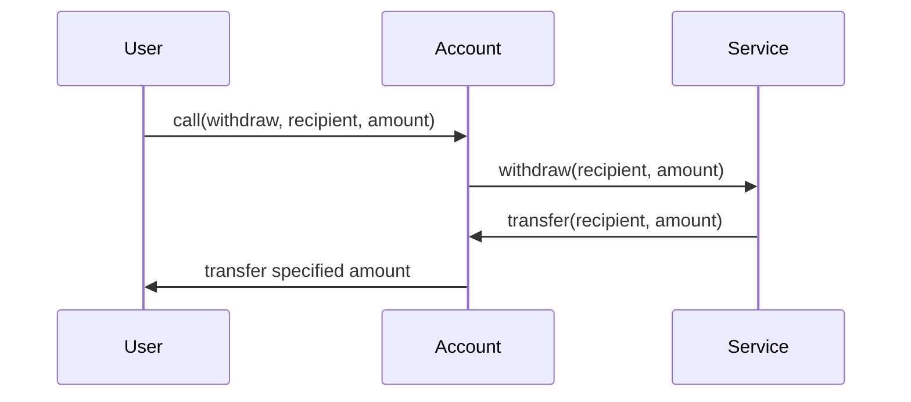

### Participants:
- factory
  - service address in storage can be changed by the voting
- owner
  - can call the account callable functions
- account
  - allow orders signed by bot
  - pass functions to service
  - script can't be updated
- bot
  - can use account for trading
- service
  - script can't be updated
  - functions for account

### Account creation:

### Withdraw:

